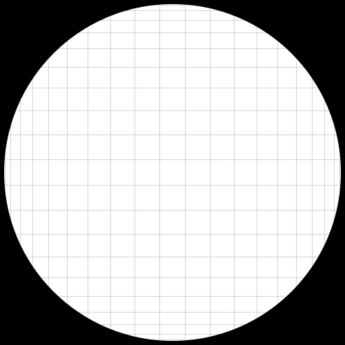

# Nice representations of multiplication tables

This is python scripts that automates the generation of diagrams based
on Mickaël Launay's video: [https://www.youtube.com/watch?v=-X49VQgi86E](https://www.youtube.com/watch?v=-X49VQgi86E)

In his video, he explains how we the classical multiplication tables
we all know and love can be drawn in a very beautiful way, such as the one below:

## Important:
#### Graphics are generated in svg format, to make gifs follow the steps below. 
#### In jupyter you can just call the animate method:
```
a = Animate_mod(4,[3,200],put_numbers=False,size=500, color="#0d6d4d")
a.animate()
```


### Generating the example
To generate this particular example, just pull the repo and run it:
```
git pull https://github.com/marhu98/Modular-Tables.git
cd Modular-Tables
make runExample
```

Then look in the folder gifs


Here is how you can generate a new image:


Here is how you can generate an animation:
* Generate all the svg
* Use cairo to convert them to png. Here there is a Dockerfile that will do it for you if don't want to set up Cairo
* Use imageio to generate the gif



